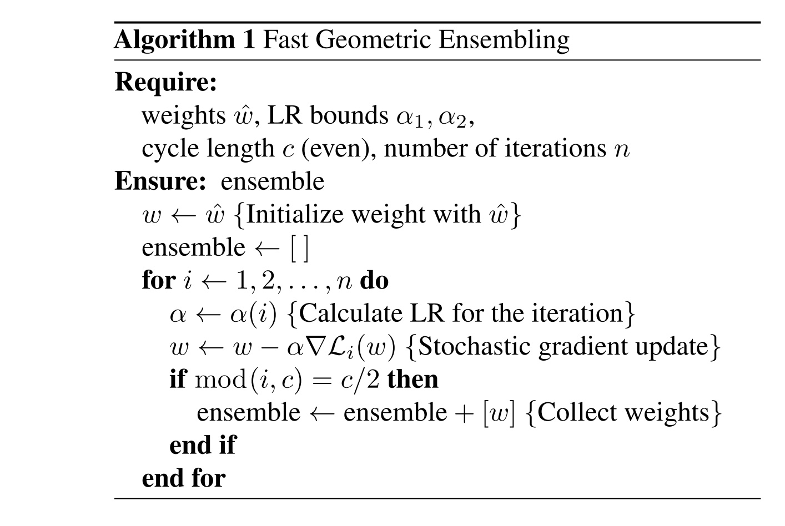
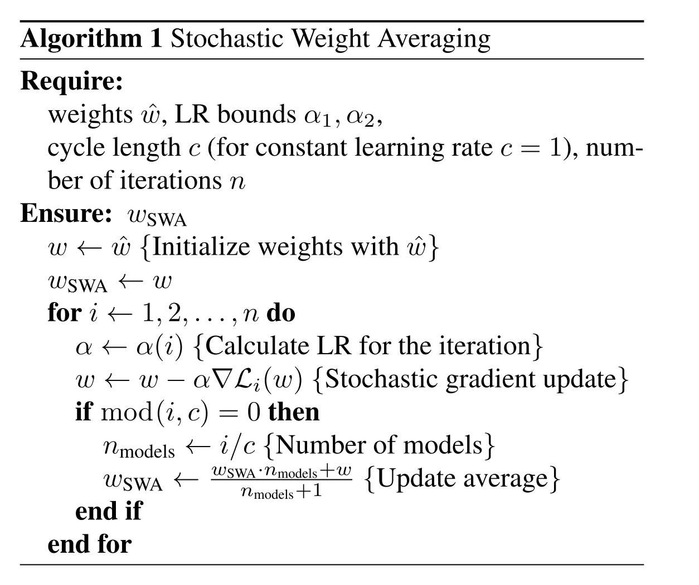

## Stochastic Weight Averaging 和 Fast Geometric Ensembling 笔记

### 主要思想
对于一个模型，在参数空间进行集成，实现的基础是CLR，基础和snapshot ensembles相同，不同的是，snapshot ensembles在得到不同的局部最优解之后，使用模型得到的结果进行集成，SWA和FGE是在参数空间进行集成，在拿到不同的局部最优解之后，使用某种方式将不同模型的参数融合成一个模型。

### FGE 算法步骤

图中所示是如何得到m和不同的模型，得到之后，在参数空间上进行集成，基本思想是直接线性集成效果不好，然后使用多项式进行集成，通过最大化期望得到多项式的参数，进而得到最终的模型。

### SWA 算法步骤

SWA的集成方法很简单，直接对所有参数进行平均。